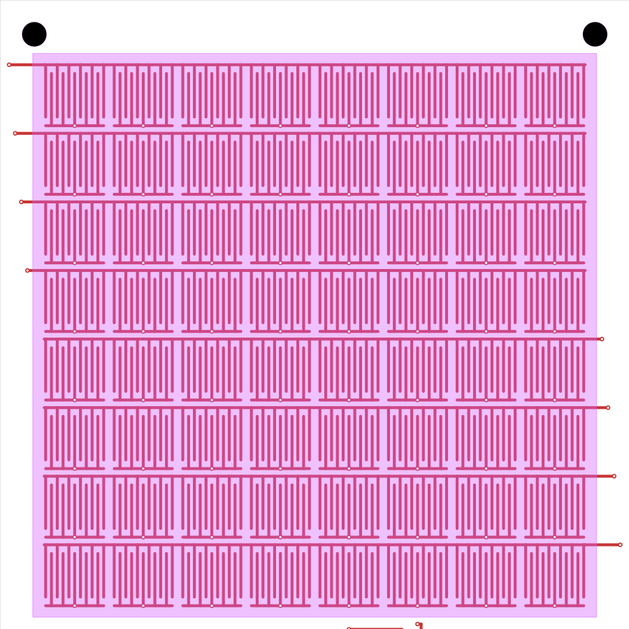
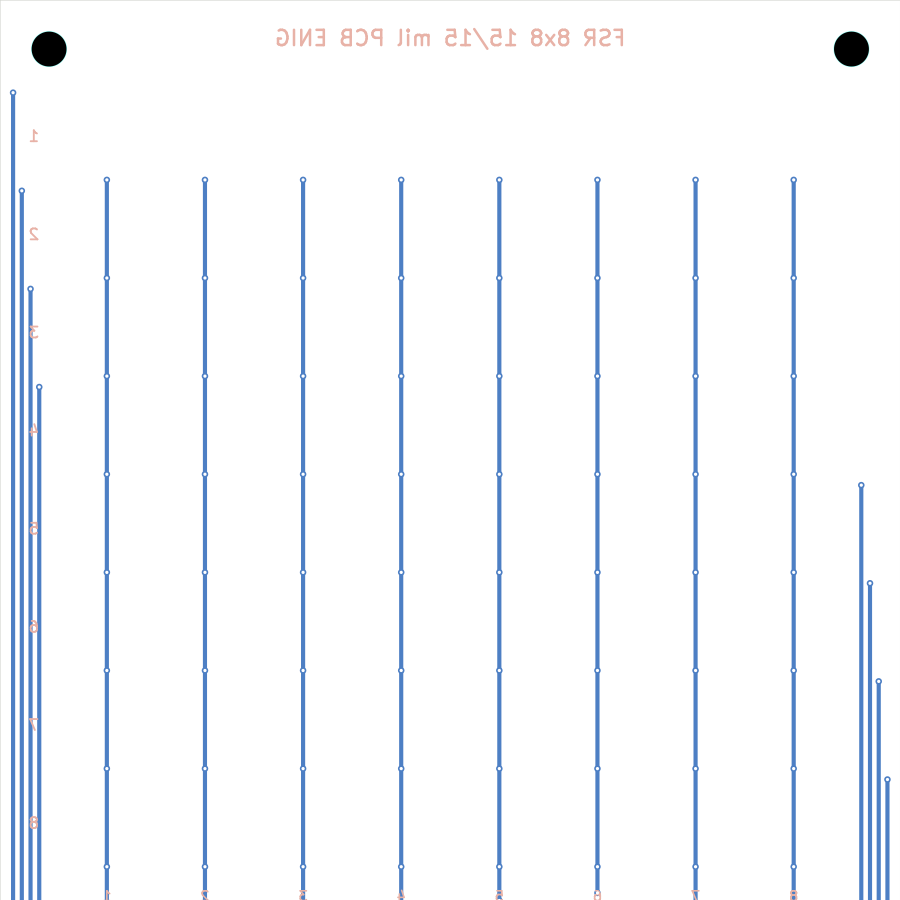

# fsr-creator

Parametric generator for **FSR (Force-Sensitive Resistor) shunt-mode matrix
sensor** boards, output as complete KiCad 10 projects.

Give it a row/column count and a few dimensions and it produces an
interdigitated-comb sensing array — the row and column copper stay
exposed on the top layer under a single solder-mask opening, so you can lay
a sheet of Velostat (or similar piezoresistive film) directly on top and
have a working pressure-sensing matrix. All fan-out routing lives on the
back layer, so the front stays a single clean sensing surface.

Each run produces a self-contained project folder: the `.kicad_pcb` /
`.kicad_pro`, a full DRC report, front/back SVG previews, an
`ORDER_INFO.txt` with connector part numbers and assembly notes, and a
zipped gerber set ready to send to a fab.

Connectors and mounting holes are placed as **real KiCad library
footprints** whenever the library provides a match (pin headers, JST
XH/PH, mounting holes, or any connector you pick from the library); a
generated equivalent is used as fallback.

<p align="center">
  
  
</p>

## Requirements

- Python 3.9+
- [KiCad](https://www.kicad.org/) **10**, installed as a normal application.
  The scripts locate `kicad-cli` and KiCad's bundled Python (with `pcbnew`)
  automatically — no `pip install` needed, no extra PATH setup.
  - macOS: `/Applications/KiCad/KiCad.app`
  - the tool searches standard install locations; if yours is elsewhere,
    make sure `kicad-cli` is on your `PATH`.

Nothing else to install — both scripts are stdlib-only.

## Quick start (UI)

```bash
python3 fsr_ui.py
```

Opens a local web page (`http://127.0.0.1:8765`) where you can set every
option — matrix size, trace/gap, sensel and pitch, auto-fit dimensions,
board style, connector type, mounting holes — and press **Create KiCad
project**. It shows the exact command that ran, the full DRC report, and
inline front/back previews, and gives you a link to download the gerber
zip. Generated projects are written next to the scripts, in
`<project-name>/`.

Run with `--port N` to use a different port, or `--no-browser` to skip
auto-opening a tab.

## Quick start (CLI)

```bash
python3 fsr_array_gen.py                       # default: 8x8, PCB, THT header
```

```bash
# custom matrix size and comb geometry
python3 fsr_array_gen.py -r 12 -c 16 --trace 0.3 --gap 0.3

# specify the sensing area directly — pitch and sensel size are derived
python3 fsr_array_gen.py --sensor-w 100 --sensor-h 60

# specify the board outline — the sensing area auto-fills it
python3 fsr_array_gen.py --board-w 80 --board-h 90 --no-mounting-holes

# flexible sensor with a ZIF/FFC tail instead of a through-hole header
python3 fsr_array_gen.py --style fpc --connector zif --tail-len 12

# JST-XH connector and M2 mounting holes, both from the KiCad library
python3 fsr_array_gen.py --connector jst-xh --hole-size m2

# find a real connector footprint in KiCad's library, then use it
python3 fsr_array_gen.py --list-connectors "FFC 1x16 P1.0"
python3 fsr_array_gen.py --connector lib \
  --connector-footprint "Connector_FFC-FPC:Molex_200528-0160_1x16-1MP_P1.00mm_Horizontal"
```

Run `python3 fsr_array_gen.py --help` for the full option reference.

## Options reference

| Group | Flag | Meaning |
|---|---|---|
| Matrix | `-r/--rows`, `-c/--cols` | sensel grid size |
| | `--trace`, `--gap` | comb finger width / spacing, mm |
| Sensels | `--sensel-w`, `--sensel-h` | active comb size per sensel, mm |
| | `--pitch` (or `--pitch-x`/`--pitch-y`) | sensel center-to-center spacing |
| | `--sensel-gap` | spacing left between sensels in auto-fit modes |
| Auto-fit dims | `--sensor-w`, `--sensor-h` | total sensing area (cols × rows direction); derives pitch and sensel size |
| | `--board-w`, `--board-h` | edge-cut outline; if given without sensor dims, the sensing area stretches to fill the board |
| Style | `--style {pcb,fpc}` | rigid PCB (1.6 mm) or flex FPC (0.13 mm) |
| Connector | `--connector {tht,jst-xh,jst-ph,zif,lib}` | connector type; resolved to a real KiCad library footprint when available |
| | `--fixed-pins` | always 16 pins: 1–8 = rows, 9–16 = columns, unused = NC — one cable/readout board fits any array up to 8×8 (ZIF pitch defaults to 1.25 mm) |
| | `--connector-pitch` | override the connector's default pitch, mm |
| | `--connector-footprint LIB:NAME` | required with `--connector lib` |
| | `--tail-len` | ZIF/FFC tail length, mm (default 6, min 5) |
| | `--tail-w` | ZIF/FFC tail width, mm (default: standard FFC width `(n+1)×pitch`, so it fits a standard ZIF slot) |
| | `--tail-contacts {top,bottom,both}` | which face(s) of the tail carry gold fingers (default top — sensor face-up into a top-contact socket; `both` works with either socket style but needs ≥0.8 mm pitch) |
| | `--list-connectors PATTERN` | search KiCad's footprint library (space-separated terms, all must match) |
| Mounting | `--mounting-holes {auto,on,off}` | 4 NPTH corner holes (auto = on for PCB, off for FPC) |
| | `--hole-size {m2,m2.5,m3,m4}` | screw size for the mounting holes (default M3) |
| Output | `--name` | project name (default `fsr_RxC`) |
| | `--outdir` | parent directory for the project folder |

If both `--sensor-*` and `--board-*` are given, sensor dimensions win and
board size is derived from them plus margins. If neither is given, sensels
are laid out from `--sensel-w/h` and `--pitch` directly and the board is
sized to fit. Anything you don't specify is chosen automatically:
trace/gap default to 15/15 mil (the finest geometry standard fabs run
cheaply), the comb is centered and filled with as many fingers as fit,
and the board outline hugs the routing — a ZIF board's body ends right
after the fan-out, with no empty strip before the tail.

## Design details

- **Rows** run one continuous spine per row on the front layer, with
  fingers hanging down into each sensel.
- **Columns** get a per-sensel spine on the front layer, with a via down
  to a vertical bus on the back layer.
- Row escapes split **left and right** of the matrix (top half exits
  left, bottom half exits right) so the routing stays compact and
  symmetric, entirely on the back layer.
- The **solder mask opening** covers the whole sensing area as a single
  aperture — this is intentional (see below), not a mistake.
- Silkscreen (title, connector labels, row/column index numbers) is on
  the **back** layer to keep the front clear for the Velostat contact
  area.
- Order **ENIG finish**: the sensing copper is permanently exposed, and
  bare copper or HASL will oxidize and degrade contact resistance over
  time.

## About the DRC report

Every run performs a full KiCad DRC pass and prints every violation
category found — **nothing is silenced via `.kicad_pro` severity
overrides.** For this design, two categories are structurally expected
and will always appear:

- `solder_mask_bridge` — the single mask opening intentionally exposes
  copper from every row and column net; the Velostat film is what turns
  that into a controlled, pressure-dependent contact.
- `track_dangling` — every comb finger is an intentionally open-ended
  stub; it only becomes "connected" once Velostat is pressed onto it.

The generator labels these as expected in its console summary and full
report. Any other category is flagged as **needing review** — if you see
one, check the coordinates in `<project>/drc.rpt` before ordering boards.

## Output layout

```
<project-name>/
  <project-name>.kicad_pcb   # open directly in KiCad 10
  <project-name>.kicad_pro
  ORDER_INFO.txt             # connector MPN/pitch, mating parts, hole sizes,
                             # fab notes — everything needed to order
  FSR.pretty/                # project footprint library for any generated
  fp-lib-table               # footprints (ZIF tail, fallbacks) — only
                             # present when one was needed
  drc.rpt                    # full, unfiltered DRC report
  preview_front.svg
  preview_back.svg
  gerbers/                   # gerber + drill files
  <project-name>_gerbers.zip # zipped, ready to upload to a fab
```

Generated project folders are not tracked in this repository (see
`.gitignore`) — this repo holds only the generator tool itself.
